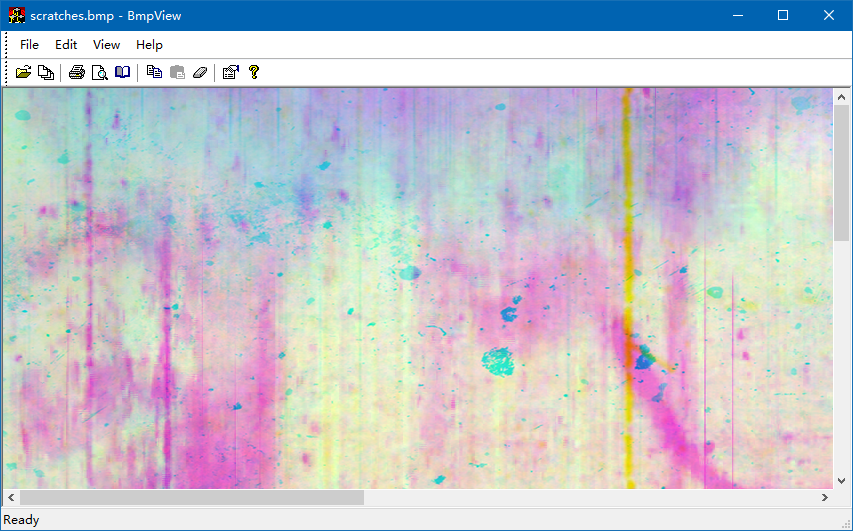
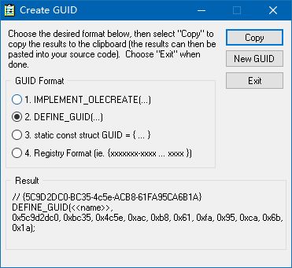
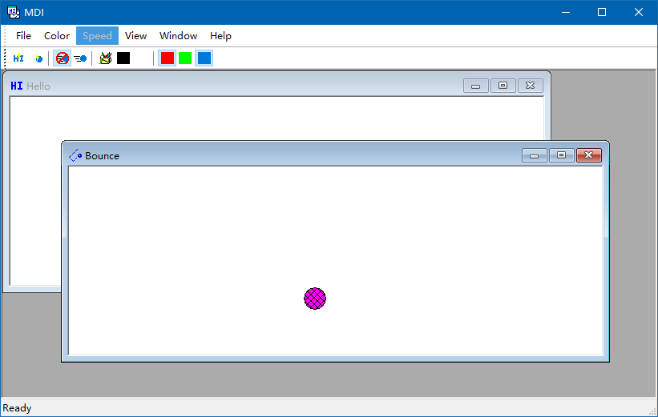
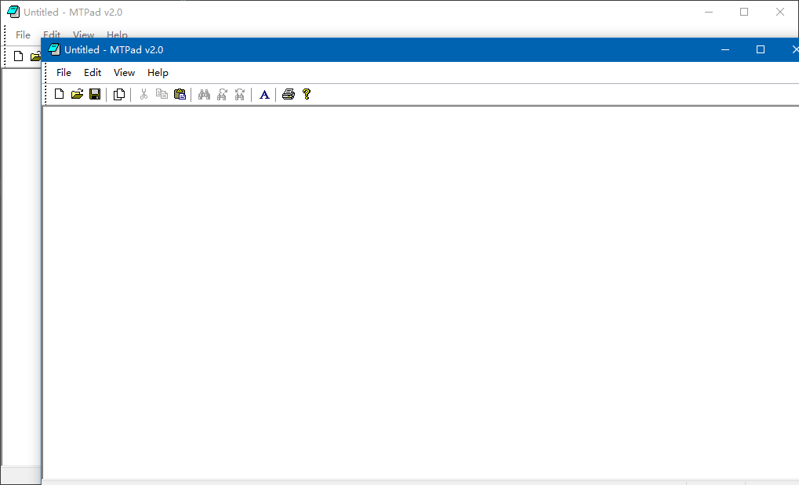
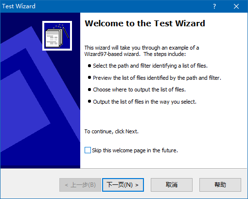
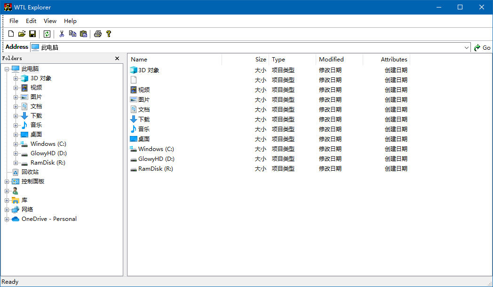

# WTL for MinGW port

This is a WTL for MinGW port library, which allows you to compile WTL projects with MinGW. Thanks to xushiwei's Winx library, the ATL code in Winx is used here, which makes the porting WTL to MinGW much easier.

> Due to the older versions of ATL and WTL, it only supports 32-bit MinGW

## Usage

WTL is a header only library, just includes these three folders
- atlport/include
- stdext/include
- wtl/include

The sample folder is an example written in WTL and can be compiled by MinGW32. Nevertheless, it is still an incompletely tested library, which should be used in production at your own risk.

